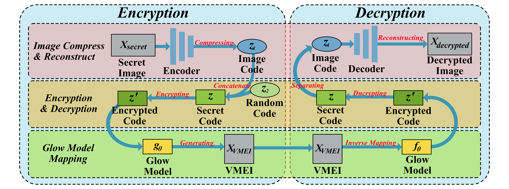

# VMIE

#### VMIE - Implementation of "Visually Meaningful Encryption via Image to Image Reversible"
 



Run the main function directly modify the path of the input image in the program to encrypted the image.

```
image_path = "img/cat.png"  # The path of the input image
```

The datasets used in the paper are [COCO2017](URL "http://cocodataset.org/#download"), the [CelebQH](URL "https://mmlab.ie.cuhk.edu.hk/projects/CelebA.html"), and the [DIV2K](URL "https://data.vision.ee.ethz.ch/cvl/DIV2K/").

The training of Glow model can refer to [glow-pytorch](URL "https://github.com/chaiyujin/glow-pytorch"), and the training code of the DCAE will coming soon.